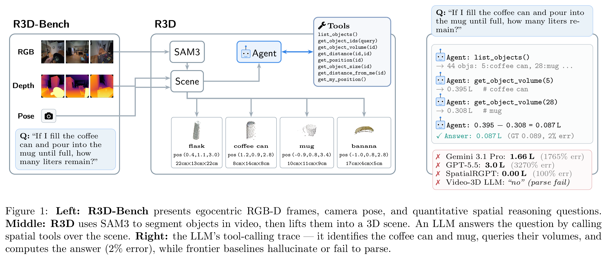

# R3D: Quantitative 3D Spatial Reasoning for Egocentric Wearables



This is the official repository for [**R3D: Quantitative 3D Spatial Reasoning for Egocentric Wearables**](https://arxiv.org/abs/2607.02921).

This repository includes:
- [**R3D-Bench**](https://huggingface.co/datasets/facebook/r3d-bench): a benchmark evaluation for quantitative 3D Spatial Reasoning using natural egocentric RGB-D video.
- **R3D**: a system for 3D spatial reasoning with tool calling.

The repository contains:
- Setup scripts for the 3,033 annotations of R3D-Bench.
- Code used for generating R3D-Bench.
- Code used for evaluating on R3D-Bench.

## Table of Contents

- [Installation](#installation)
- [Data Setup](#data-setup)
  - [R3D-Bench (Hugging Face)](#r3d-bench-hugging-face)
  - [Obtain ADT Sequences](#obtain-adt-sequences)
  - [Extract Frames](#extract-frames)
- [Quick Start - Running Your Model On R3D-Bench](#quick-start---running-your-model-on-r3d-bench)
  - [Standard VLM (RGB Only)](#standard-vlm-rgb-baseline)
  - [Dataset Tutorial](#dataset-tutorial)
- [Running R3D Evaluation on R3D-Bench](#running-r3d-evaluation-on-r3d-bench)
  - [Step 1: Build Scene](#step-1-build-scene)
  - [Step 2: Generate Responses](#step-2-generate-responses)
  - [Step 3: Generate Scores](#step-3-generate-scores)
  - [Step 4: Generate Eval Table](#step-4-generate-eval-table)
- [Generating Additional Samples](#generating-additional-samples)
- [Scripts](#scripts)
- [Key Flags](#key-flags)
- [Evaluation Entry Points](#evaluation-entry-points)
- [License](#license)
- [Citation](#citation)

## Installation

```bash
git clone https://github.com/facebookresearch/r3d
cd r3d
pip install -e . --extra-index-url https://download.pytorch.org/whl/cu128
```

This installs everything, including PyTorch and vLLM (the default inference backend). The `--extra-index-url` pulls the CUDA build of PyTorch/vLLM — change `cu128` to match your CUDA toolkit.

Requirements: Python 3.10+, CUDA-capable GPU.

## Data Setup

### R3D-Bench (Hugging Face)

The R3D-Bench data lives on Hugging Face Hub at [`facebook/r3d-bench`](https://huggingface.co/datasets/facebook/r3d-bench) as a Parquet, split into these configs:

- `qa_annotations` — the 3,033 Q&A annotations in R3D-Bench
- `segmentations` — per-object per-video SAM3 segmentation masks used in evaluations
- `meshes` — per-object 3D reconstructed meshes from SAM3D, used in evaluations

Every script takes a `--dataset` flag (default `facebook/r3d-bench`) and fetches only the configs it needs on first use via `huggingface_hub`, caching them under `$HF_HOME`. To use a local mirror or fork instead, pass `--dataset <org>/<repo>`.

R3D-Bench requires downloading Aria Digital Twin, described in the next step.

### Obtain ADT Sequences

R3D-Bench is built on the 57 [Aria Digital Twin (ADT)](https://www.projectaria.com/datasets/adt/) sequences listed in [`sequences.txt`](sequences.txt). Request access on the ADT page; you will receive a personal CDN file (a JSON of time-limited download URLs). Point `CDN_FILE` at your copy.

Download all 57 sequences required by R3D-Bench with every data type (RGB, depth, segmentation, SLAM pose, ground truth, etc.) using the `aria_dataset_downloader` bundled with `projectaria-tools` (installed above):

```bash
export ADT_ROOT=/path/to/ADT
export CDN_FILE=/path/to/your_ADT_download_urls.json

aria_dataset_downloader \
    --cdn_file "$CDN_FILE" \
    --output_folder "$ADT_ROOT" \
    --data_types 0 1 2 3 4 5 6 7 8 9 \
    --sequence_names $(cat sequences.txt)
```

Each sequence is ~6–7 GB across all data types (~370 GB total). This creates one subfolder per sequence under `$ADT_ROOT`.

### Extract Frames
R3D-Bench mandates that RGB frames are extracted at 3FPS and 512x512 resolution. Extract them from ADT sequences and place them in a folder with this script:

```bash
# Find all sequence directories
SEQ_PATHS=$(find $ADT_ROOT -maxdepth 1 -mindepth 1 -type d | sort | tr '\n' ' ')

python -m r3d.pipeline.scripts.populate_frames \
    --sequence-paths $SEQ_PATHS \
    --output-dir $ASSETS/frames \
    --fps 3.0 \
    --image-size 512 \
    --num-workers 16
```

This produces:
- `frames/frames.db` — frame metadata (timestamps, intrinsics, poses)
- `frames/frame_data/` — RGB and depth PNGs

## Quick Start - Running Your Model On R3D-Bench

### Standard VLM (RGB Only)

This command is primarily for demonstration purposes. RGB-only models do not usually perform very well on R3D-Bench, but we include this example command so that researchers can modify it for their own purposes.

To run a standard VLM (RGB-only, no depth inputs) on R3D-Bench, use `r3d.scripts.rgb_overlay_evals`. Add `--overlay` to additionally paint the referenced objects' SAM3 masks onto the frames, and `--score` to score immediately after generation. `--max-frames` caps how many frames from each question's window are sent to the model. In our paper evaluations we do not limit the frames sent to models. In this example command, we set the value to 16 for computational efficiency. Removing the flag will result in all frames being set to the model. You may need to set `--max-model-len` accordingly. Here is the command:

```bash
python -m r3d.scripts.rgb_overlay_evals \
    --dataset facebook/r3d-bench \
    --frames-dir $ASSETS/frames \
    --model qwen3-vl-8b --hf-model Qwen/Qwen3-VL-8B-Instruct \
    --backend vllm --data-parallel-size 8 \
    --max-frames 16 \
    --overlay --score \
    --output-dir /tmp/r3d/rgb_overlay
```

Modify this evaluation command to run your own VLM that accepts depth and pose as input.

For reference, the example above produces the following on the full 3,033-annotation R3D-Bench. Multiple-choice types report mean accuracy; distance and volume types report Mean Relative Accuracy (MRA). OVERALL is the mean over all 15 question types. All values are percentages; higher is better.

| Question type | Metric | RGB 8B |
|---|:---:|---:|
| `gap_fit` | Acc | 67.7 |
| `nearest_from_set` | Acc | 61.0 |
| `top_higher` | Acc | 62.9 |
| `which_taller` | Acc | 76.2 |
| `which_longer_dim` | Acc | 68.9 |
| **Multiple-choice avg** | Acc | **67.3** |
| `global_how_far` | MRA | 46.9 |
| `global_how_far_from_me` | MRA | 36.2 |
| `global_how_long` | MRA | 55.1 |
| `how_much_taller` | MRA | 33.1 |
| `how_much_longer_dim` | MRA | 36.3 |
| `total_fly_distance` | MRA | 20.5 |
| `total_walk_distance` | MRA | 17.9 |
| **Distance avg** | MRA | **35.1** |
| `volume_estimation` | MRA | 14.4 |
| `pour_leftover` | MRA | 0.0 |
| `pour_room_left` | MRA | 3.6 |
| **Volume avg** | MRA | **6.0** |
| **OVERALL (all 15)** | — | **40.0** |

### Dataset Tutorial

`r3d.scripts.dataset_tutorial` is a runnable walkthrough that doubles as worked example code — it reuses the same pipeline utilities the R3D eval below uses (HF parquet stores, depth-lifting + OBB fit from `build_scene`, mesh rescaling from `volume`, and the viz/video helpers). It runs five demos (select a subset with `--demos`):

- `annotation` — load a QA annotation and print its fields
- `mesh` — load a SAM3D mesh and save it to disk
- `pointing` — visualize a pointing annotation: overlay the object's ADT ground-truth mask on its single reference frame (one per object per video). Requires `--adt-root`.
- `scene_video` — overlay all SAM3 masks across a sequence into an MP4, captioned with the question + GT answer
- `depth_lift` — depth-lift one volumetric object and save its 3D point cloud (`.ply`), mask, fitted 3D bounding box (drawn + `.npz`), and the SAM3D mesh rescaled to that box (`.glb`)

```bash
python -m r3d.scripts.dataset_tutorial \
    --dataset facebook/r3d-bench \
    --frames-dir $ASSETS/frames \
    --output-dir /tmp/r3d_tutorial \
    --sequence Apartment_release_clean_seq131_M1292 \
    --object mug \
    --adt-root $ADT_ROOT   # only needed for the pointing demo
```

## Running R3D Evaluation on R3D-Bench
Running official R3D evaluation and scoring runs in 4 steps. All intermediate outputs are stored in SQLite databases.

### Step 1: Build Scene

Depth-lift segmentation masks to 3D, assign each point to an object by multi-view
plurality vote (matching the production reconstruction), filter outliers with KNN, and
fit gravity-aligned oriented bounding boxes:

```bash
python -m r3d.pipeline.scripts.build_scene \
    --dataset facebook/r3d-bench \
    --frames-dir $ASSETS/frames \
    --output-dir $ASSETS/scene \
    --depth-stride 4 \
    --knn-k 6 \
    --mask-erosion 0 \
    --max-points-per-object 50000
```

This produces:
- `scene/scene.db` — per-object 3D bounding boxes, visibility, and coverage
- `scene/object_points.db` — per-object 3D point clouds

### Step 2: Generate Responses

Run a VLM on R3D-Bench with vLLM, which provides fast inference with automatic KV cache reuse across tool-use turns.

```bash
# Qwen3-VL-8B on 8 GPUs (8-way data parallel)
python -m r3d.pipeline.scripts.generate_responses \
    --dataset facebook/r3d-bench \
    --scene-db $ASSETS/scene/scene.db \
    --frames-dir $ASSETS/frames \
    --model qwen3-vl-8b \
    --hf-model Qwen/Qwen3-VL-8B-Instruct \
    --backend vllm \
    --require-tracked-objects \
    --no-images \
    --data-parallel-size 8 \
    --concurrency 8 \
    --output-dir /tmp/r3d/responses_8b
```

```bash
# Qwen3.6-35B on 4 GPUs (4-way data parallel)
# Note: set CUDA_VISIBLE_DEVICES to control which GPUs are used.
# The 35B model requires --max-model-len to fit in GPU memory.
CUDA_VISIBLE_DEVICES=0,1,2,3 python -m r3d.pipeline.scripts.generate_responses \
    --dataset facebook/r3d-bench \
    --scene-db $ASSETS/scene/scene.db \
    --frames-dir $ASSETS/frames \
    --model qwen36-35b \
    --hf-model Qwen/Qwen3.6-35B-A3B \
    --backend vllm \
    --require-tracked-objects \
    --no-images \
    --data-parallel-size 4 \
    --concurrency 32 \
    --max-model-len 24576 \
    --output-dir /tmp/r3d/responses_35b
```

### Step 3: Generate Scores

Score the responses and produce per-question-type metrics:

```bash
python -m r3d.pipeline.scripts.generate_scores \
    --dataset facebook/r3d-bench \
    --responses-db /tmp/r3d/responses_8b/responses.db \
    --output-dir /tmp/r3d/scores
```

This produces:
- `scores.db` — per-annotation scores
- `eval_report.json` — aggregate and per-sequence metrics
- `eval_summary.txt` — human-readable summary

### Step 4: Generate Eval Table

Compare results across models in a formatted table:

```bash
python -m r3d.pipeline.scripts.generate_eval_table \
    --reports \
      "R3D 8B:/tmp/r3d/scores_8b/eval_report.json" \
      "R3D 35B:/tmp/r3d/scores_35b/eval_report.json" \
    --output /tmp/r3d/eval_results.txt
```

This produces a table with per-category accuracy (MC), MRA (distance/volume), within-threshold accuracy, and mean % error, plus grouped averages and overall scores.

Expected per-question-type results on the full 3,033-annotation R3D-Bench (R3D 8B = `Qwen3-VL-8B-Instruct`, R3D 35B = `Qwen3.6-35B-A3B`). Multiple-choice types report **mean accuracy**; distance and volume types report **Mean Relative Accuracy (MRA)**. OVERALL is the mean over all 15 question types. All values are percentages; higher is better.

| Question type | Metric | R3D 8B | R3D 35B |
|---|:---:|---:|---:|
| `gap_fit` | Acc | 88.7 | 98.4 |
| `nearest_from_set` | Acc | 82.3 | 95.6 |
| `top_higher` | Acc | 71.4 | 80.4 |
| `which_taller` | Acc | 89.8 | 92.0 |
| `which_longer_dim` | Acc | 94.7 | 94.7 |
| **Multiple-choice avg** | Acc | **85.4** | **92.2** |
| `global_how_far` | MRA | 89.1 | 89.5 |
| `global_how_far_from_me` | MRA | 64.8 | 95.1 |
| `global_how_long` | MRA | 79.3 | 82.4 |
| `how_much_taller` | MRA | 66.2 | 68.4 |
| `how_much_longer_dim` | MRA | 50.7 | 56.6 |
| `total_fly_distance` | MRA | 32.9 | 69.4 |
| `total_walk_distance` | MRA | 14.1 | 37.0 |
| **Distance avg** | MRA | **56.7** | **71.2** |
| `volume_estimation` | MRA | 46.4 | 47.3 |
| `pour_leftover` | MRA | 33.3 | 32.6 |
| `pour_room_left` | MRA | 35.5 | 34.5 |
| **Volume avg** | MRA | **38.4** | **38.1** |
| **OVERALL (all 15)** | — | **62.6** | **71.6** |

Typical run-to-run variance on the aggregate metrics is ~0.5%.

## Generating Additional Samples

Most users do not need this — R3D-Bench is published on Hugging Face and downloaded automatically. This section is for generating additional Q&A samples (e.g. new sequences or more questions per type) using the same production pipeline. Note that this does not include filtering for segmentation quality or question difficulty described in Section 3.2 of our paper.

### Obtain ADT Object Meshes

Volume ground truth is computed from the ADT objects' 3D meshes. These are not part of the per-sequence ADT download — they come from the [Digital Twin Catalog (DTC)](https://www.projectaria.com/datasets/dtc/). Request access there; you will receive a DTC objects CDN file. Download the ADT-release object meshes with the `dtc_object_downloader` bundled with `projectaria-tools`:

```bash
export DTC_CDN_FILE=/path/to/your_DTC_objects_ADT_download_urls.json
export ADT_OBJECT_LIBRARY=$HOME/adt_object_library

dtc_object_downloader -r ADT -c "$DTC_CDN_FILE" -o "$ADT_OBJECT_LIBRARY"
```

This writes one `3d-asset.glb` per object at `$ADT_OBJECT_LIBRARY/{object_name}/3d-asset.glb` (~400 objects).

One object, `Flask`, is not part of the `ADT` release and so is missing from the command above. You must download this one mesh separately from the full DTC catalog CDN file (`DTC_objects_all_download_urls.json`, also from the DTC access page):

```bash
export DTC_CDN_ALL=/path/to/your_DTC_objects_all_download_urls.json

dtc_object_downloader -c "$DTC_CDN_ALL" -o "$ADT_OBJECT_LIBRARY" --objects Flask -k 3d-asset_glb -x __nomatch__
```

This adds `$ADT_OBJECT_LIBRARY/Flask/3d-asset.glb`, completing the object library.

### Generate the Q&A annotations

With the frames (Extract Frames, above) and the object library in place, regenerate the annotations with the exact production settings via [`scripts/generate_dataset.sh`](scripts/generate_dataset.sh):

```bash
export ADT_ROOT=/path/to/ADT
export ADT_OBJECT_LIBRARY=$HOME/adt_object_library
export ASSETS=/path/to/r3d_assets   # must contain frames/frames.db

./scripts/generate_dataset.sh /tmp/r3d/annotations
```

## Scripts

The [`scripts/`](scripts/) directory wraps the commands used to build and evaluate R3D-Bench for the paper. The eval scripts reproduce the paper's R3D results within run-to-run noise (see the results table above).

| Script | What it runs |
|--------|--------------|
| `run_populate_frames.sh` | Extract frames from ADT sequences |
| `generate_dataset.sh` | Generate Q&A annotations with production filters (static objects, pointing disambiguation, min-fov 6.0, min-visibility 0.5, 100/type) |
| `run_build_scene.sh` | Build the 3D scene (depth-lift + gravity-aligned OBB) |
| `run_eval_8b_full.sh` | R3D eval — Qwen3-VL-8B, `tool_use` + `mesh_rescaled`, no images, DP=8 |
| `run_eval_35b.sh` | R3D eval — Qwen3.6-35B-A3B, DP=4 |
| `run_rgb_baseline.sh` | RGB baseline — Qwen3-VL-8B, images + SAM3 mask overlay |
| `run_eval_8b_quick.sh` | 100-annotation smoke test (not a paper number) |
| `run_tests.sh` | Unit tests |

## Key Flags

| Flag | Description |
|------|-------------|
| `--dataset ORG/REPO` | Hugging Face R3D-Bench repo (default: `facebook/r3d-bench`) |
| `--num-workers N` | Parallel frame extraction workers (frame extraction) |
| `--backend vllm\|hf` | Inference backend (Step 2, default: vllm) |
| `--data-parallel-size N` | Number of model replicas (vLLM only) |
| `--max-model-len N` | Maximum context length in tokens (vLLM only, required for large models) |
| `--max-annotations N` | Limit annotations for quick testing |
| `--require-tracked-objects` | Skip annotations with untracked objects |
| `--no-images` | Text-only (no frames sent to model). Useful for rapid evaluation when using tools. |
| `--concurrency N` | Concurrent annotation processing (default: 8) |
| `--question-types TYPE [TYPE ...]` | Restrict to specific question types |

## Evaluation Entry Points

| Entry point | Description |
|-------------|-------------|
| `r3d.pipeline.scripts.generate_responses` | R3D tool-use: multi-turn, model calls spatial tools (get_distance, get_position, get_volume, etc.) over the reconstructed 3D scene |
| `r3d.scripts.rgb_overlay_evals` | RGB baseline: single-turn, model sees multi-frame images, optionally with `--overlay` segmentation masks |

## License

This project is licensed under [Creative Commons Attribution-NonCommercial 4.0 International (CC BY-NC 4.0)](LICENSE).

## Citation

When using our work, please cite as follows:

```bibtex
@misc{horton2026r3dquantitative3dspatial,
      title={R3D: Quantitative 3D Spatial Reasoning for Egocentric Wearables},
      author={Maxwell Horton and Wei Lu and Quan Tran and Yury Astashonok and Kirmani Ahmed and Babak Damavandi and Anuj Kumar and Xiao Zhang and Seungwhan Moon},
      year={2026},
      eprint={2607.02921},
      archivePrefix={arXiv},
      primaryClass={cs.CV},
      url={https://arxiv.org/abs/2607.02921},
}
```
